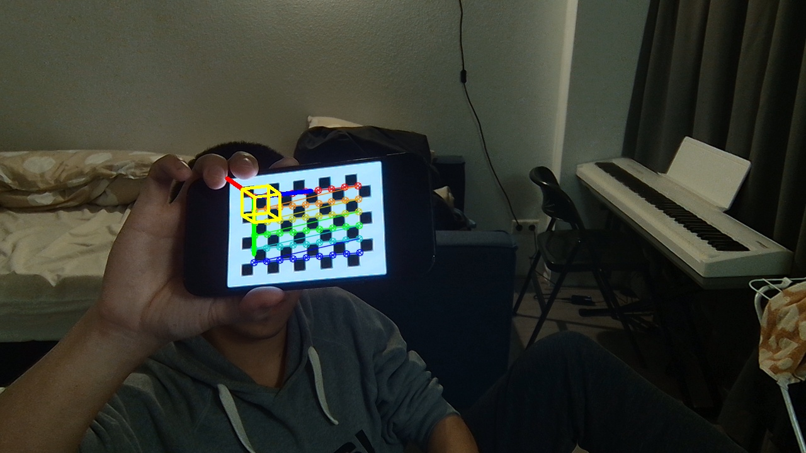
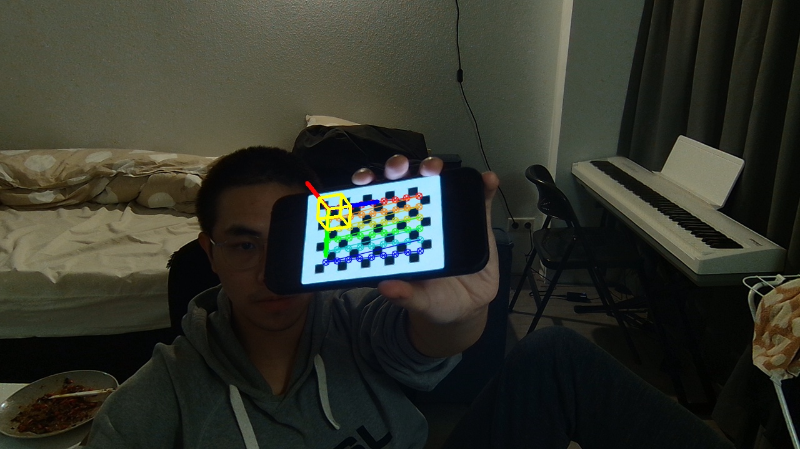
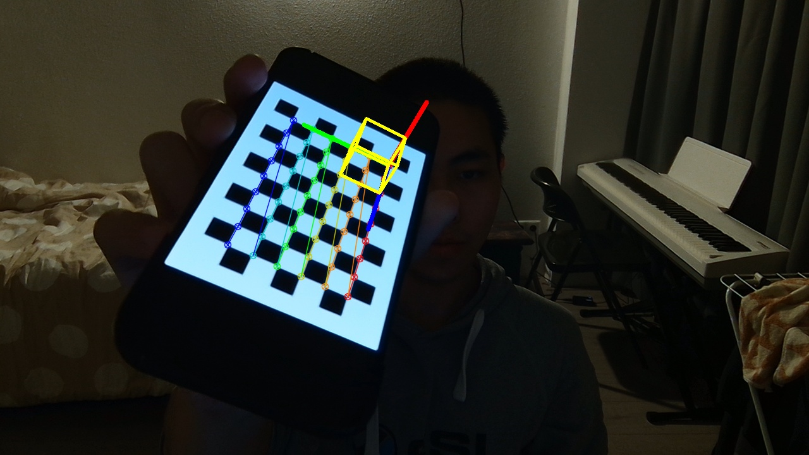

<h1 align="center">Assignment 1 of Computer Vision👋</h1>
<p>
  
  <a href="123" target="_blank">
    
  </a>
  <a href="https://github.com/Monsterlady-Studio/lastwordExchange/blob/master/LICENSE" target="https://raw.githubusercontent.com/Monsterlady-Studio/lastwordExchange/master/LICENSE?token=AJGKZIFFEUQVTR2MGIHOZ5S7G3DIY">
    
  </a>
</p>

[//]: # (> 方便快捷的储存游戏账号和密码)

[//]: # (### 🏠 [主页]&#40;123&#41;)

[//]: # ()
[//]: # (### ✨ [Demo]&#40;123&#41;)
## IDE


[PyCharm](https://www.jetbrains.com/pycharm/) <br />

## Prerequisites
- webcam
- mouse

## Environment
```python
Python Version: 3.8.1
```


## Install
```python
pip install -r requirements.txt
```

## Usage
```python
python main.py
```


[//]: # ([Android Studio]&#40;https://redirector.gvt1.com/edgedl/android/studio/install/4.0.1.0/android-studio-ide-193.6626763-windows.exe&#41; <br />)

[//]: # (Xcode&#40;ios&#41;)


## Offline Run

[//]: # (We conducted three calibration runs to evaluate the impact of different image qualities and calibration settings. )
The resolution of our training and test images is 1280 * 720.
<br/>
We run the offline phase three times, each time saving the camera’s intrinsic/extrinsic parameter matrices.
<br/>
For those images that cannot be detected, we will require manual marking of 4 corner points.
<br/>
The left click marks and the right click deletes.

## Online Run
In the online stage, we will use the camera's internal parameter matrix and webcam to perform real-time detection.
### Run 1
- **Intrinsic Matrix:**
  - The Intrinsics Matrix is saved as a npy file.
    ```python
    print(np.load('parameters/offline-run-1/mtx.npy'))
    
    [[883.09665013   0.         639.79836048]
     [  0.         883.4155593  361.14827873]
     [  0.           0.           1.        ]]
    ```
- **Example Screenshot:**
  - 
- **Quality Assessment:**
  - This round of calibration could give the most accurate results since it combines a broad viewing angle with a range of picture locations, allowing for more precise camera intrinsic parameter estimations. However, it should be emphasized that photographs with manually marked corner points may contain inaccuracies resulting from the subjectivity and inaccuracy of the human annotation process.

### Run 2
- **Intrinsic Matrix:**
  - The Intrinsics Matrix is saved as a npy file.
    ```python
    print(np.load('parameters/offline-run-2/mtx.npy'))
    
    [[882.03205399   0.         635.52509628]
     [  0.         882.67450761 361.49720216]
     [  0.           0.           1.        ]]
    ```
- **Example Screenshot:**
  - 
- **Quality Assessment:**
  - Compared to Run 1, Run 2 uses fewer photos, which may restrict the variety of viewing angles and locations, limiting the calibration's comprehensiveness. However, because all corner points are detected automatically, human labelling mistakes are reduced, and corner point recognition is more consistent and accurate.

### Run 3
- **Intrinsic Matrix:**
  - The Intrinsics Matrix is saved as a npy file.
    ```python
    print(np.load('parameters/offline-run-3/mtx.npy'))
    
    [[884.56975037   0.         634.71040075]
     [  0.         885.4619426  363.0267169 ]
     [  0.           0.           1.        ]]
    ```
- **Example Screenshot:**
  - 
- **Quality Assessment:**
  - This round of calibration uses the fewest images and may not adequately capture the camera's optical distortion and focal length changes, resulting in reduced accuracy of internal parameter estimates. Especially when dealing with test images that have a significant tilt or are close to the edge of the image, the lack of calibration can be even more pronounced.

### Choice Tasks and Implementation
Here, briefly mention the choice tasks you've selected for the project and how you implemented them. For example:

- **Task 1: real-time performance with webcam in online phase**
  - Implemented a real-time rendering of the detected chessboard corners and the 3D cube using the OpenCV library.
  - Detail Method: ``` manually_process.utils.get_webcam_snapshot```
- **Task 2: Iterative Detection and Rejection of Low-Quality Images**
  - Implemented a function to iteratively reject images that contribute to a high reprojection error, enhancing the overall calibration quality.
  - Detail Method: ``` manually_process.utils.filter_bad_images```
- **Task 3: Image Quality Enhancement**
  - Applied preprocessing steps to reduce reflections and enhance edges before calibration to improve the detection accuracy of chessboard corners.
  - Detail Method: ``` manually_process.utils.reduce_light_reflections```

## Conclusion
Summarize the findings from the calibration runs and how different parameters or preprocessing steps influenced the camera calibration process's accuracy and quality.


## Students(Group 18)

👤 **Ruikang Xu - 2881349**

👤 **Yuheng Cao - 9441700**

## 🤝 Contribution

All team members worked together in several meetings. All team members equally devoted to the
parts of the assignment.


