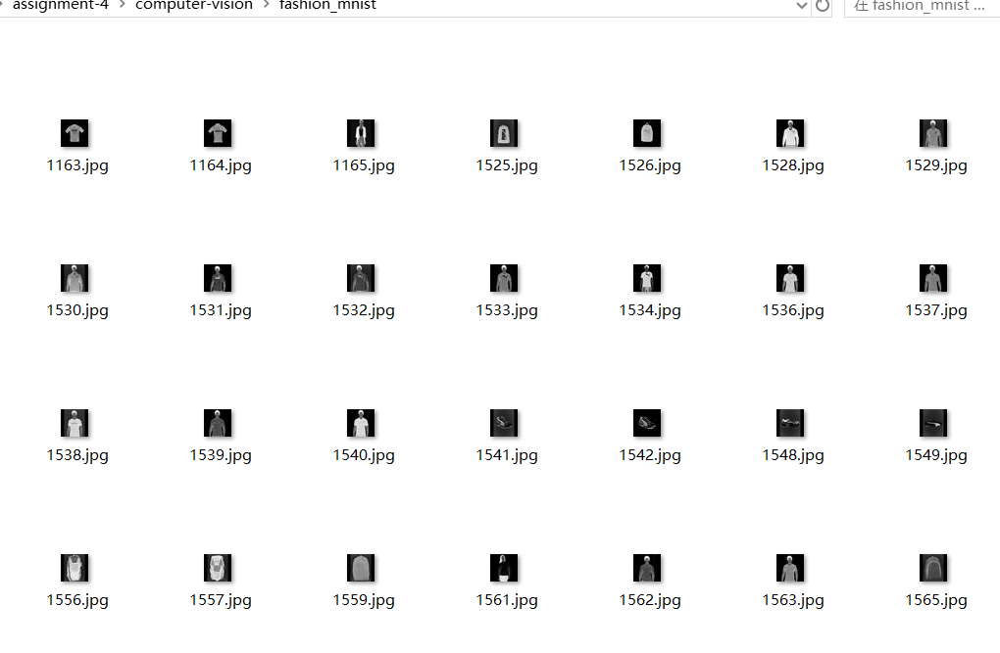

# Students Info
Ruikang Xu 2881349
Yuheng Cao 9441700

# Environment Setup
```python
conda create -n pytorch python=3.8
conda activate pytorch
pip install torch torchvision torchaudio --index-url https://download.pytorch.org/whl/cu118
```

# Models
## Baseline Model
- ### Convolutional Layers:
* * conv1: The first convolutional layer accepts a single-channel (e.g., grayscale) picture input with a padding of two to preserve spatial dimensions after convolution. It generates six feature maps by using six 5x5 filters (or kernels). Padding is employed to keep spatial dimensions the same as the original LeNet-5, which was built for 32x32 pixel inputs, although it has most likely been updated for 28x28 pixel inputs (as shown in datasets such as MNIST).
* * conv2: The second convolutional layer takes the six feature maps from conv1 and applies 16 filters of size 5x5, without padding, to minimize the spatial dimensions of the resultant feature maps.

- ### Pooling Layers: 
Every convolutional layer is followed by a 2x2 max pooling operation (F.max_pool2d). This cuts the feature maps' spatial dimensions in half, making the representation more compact and allowing higher-level characteristics to emerge.
- ### Fully Connected Layers:
* * fc1: The first fully connected layer flattens the output from the preceding max pooling layer and connects it to a layer with 120 nodes.
* * fc2: The second fully connected layer takes the 120 nodes as input and connects them to 84 nodes.
* * fc3: The final fully connected layer maps the 84 nodes to 10 output nodes, corresponding to the number of classes in the classification task.

- ### Weight Initialization:
Weights are initialized using the Kaiming/He method, which is suitable for layers followed by ReLU activations. This method helps prevent the vanishing or exploding gradients problem in deep neural networks.

- ### Activation Function:
The ReLU (Rectified Linear Unit) activation function is used throughout the network. It introduces non-linearity to the model, allowing it to learn more complex functions and generally works well in deep learning models.

- ### Loss Function:
The `nn.CrossEntropyLoss()` from PyTorch is used, which combines a softmax layer with the cross-entropy loss in one single class. This loss function is appropriate for multi-class classification problems.

- ### Optimizer:
The Adam optimizer (`torch.optim.Adam`) is utilized for adjusting network weights. Adam is known for its efficiency with large datasets and high-dimensional spaces.

- ### Learning Rate:
A learning rate of 0.001 is used, which determines the step size at each iteration while moving toward a minimum of the loss function. This value is a commonly used default for the Adam optimizer.

- ### Batch Size:
The batch size set as `32` within the DataLoader. It defines the number of samples that will be propagated through the network before the optimizer updates the model parameters.

- ### Epochs:
Training is set to run for `10` epochs, which means the learning algorithm will work through the entire training dataset a total of 10 times.


## Variant Model 1
The key changes between the version 1 and baseline models are the number of output channels in the first convolutional layer and the layout of the second convolutional layer.
<br/>
Because in baseline model, it is clear showing that the model is overfitting, so we can try to reduce the number of output channels in the first convolutional layer to see if it helps to reduce overfitting.
Reducing the number of output channels can help simplify the model by reducing the number of model parameters. Such a modify could be done to find out the influence of the model's simplicity on performance or to reduce overfitting.


- Performance on Test Set:
````python
Test Loss: 0.0102, Test Accuracy: 0.8859
````
- Result Discussion and Comparison with Baseline Model:

The first variant model is slightly simpler in complexity compared to the baseline model because the number of output channels of the first and second convolutional layers is reduced.
The accuracy of the first variant model is slightly reduced on the test set compared to the baseline model.
This may be due to the reduced number of output channels, which results in a less expressive model, thus affecting the performance of the model.
However, this simplification helps to reduce the overfitting of the model as the complexity of the model is reduced and the generalization ability of the model may be improved.
As a result, the first variant model has comparable performance to the baseline model on the test set, but is simpler in terms of model complexity.
On the confusion matrix, it is not as good as the baseline model in the categorization of category 6, but better in the categorization of category 0.
For the degree of fit, it is still an overfitting state.
## Variant Model 2
But for variant 1, the model is still overfitted, so we thought of adding dropout to the fully-connected layer using the dropout rate of 0.5 to see if it helps to reduce overfitting.


- Performance on Test Set:
````python
Test Loss: 0.0106, Test Accuracy: 0.8781
````
- Result Discussion and Comparison with Variant Model 1:

During the training and validation process, we see that the overfitting problem is solved, but the accuracy is much lower than the variant model 1. This could be due to the introduction of dropout, which leads to a decrease in the accuracy of the model. In the confusion matrix, we can see that the model performs slightly lower in classifying category 6 compared to variant model 1. The complexity has remained the same as variant model 1.

## Variant Model 3
After seeing that Model 2 did not overfit, we replaced ReLU with LeakyReLU in this variant in all the places where we used the activation function.The parameter negative_slope=0.01 of LeakyReLU defines the slope of the function in the negative portion of the function, which allows for the gradient to be non-zero in negative intervals, which helps to prevent neuron death problems .


- Performance on Test Set:
````python
Test Loss: 0.0098, Test Accuracy: 0.8852
````
- Result Discussion and Comparison with Variant Model 2:

The change to the LeakyReLU activation function does not have a significant impact on the model complexity because the activation function generally does not increase the parameters that can be learned From the performance of the test set, variant model 3 outperforms variant model 2, approaching the performance of the baseline model. This may be due to the introduction of LeakyReLU, which makes it easier for the model to converge during training, thus improving the performance of the model. In terms of the loss and accuracy icons, the overfitting problem is solved, with a continuous downward trend in loss and a continuous upward trend in accuracy. In the confusion matrix, we can see that the model performs slightly better in classifying category 6 compared to variant model 2. If the epoch number is increased further, there may be better performance.

## Variant Model 4
Showing signs of slow convergence during model training in model three, our reduced learning rate allows for finer weight updates, which helps the model find the minimum of the loss function more quickly. We can try to set the learning rate as half of the previous `0.0005` to see if it helps to speed up the convergence of the model.


- Performance on Test Set:
````python
Test Loss: 0.0109, Test Accuracy: 0.8744
````
- Result Discussion and Comparison with Variant Model 3:

The adjustment of the learning rate itself does not directly change the complexity of the model, but it affects the convergence speed and performance performance of the model. From the performance of the test set, the performance of variant 4 is slightly lower than that of variant 3, but still better than that of variant 2. This may be due to the fact that the reduction of the learning rate leads to a slower convergence speed of the model, which affects the performance of the model. From the loss and accuracy icons, the model converges slower, but the performance of the model may improve in later stages of the training process. The overfitting problem is solved, the loss has a continuous decreasing trend, and the accuracy has a tendency to smooth out. In the confusion matrix, we can see a slight decrease in the model's performance in classifying category 6 compared to variant model 3.

# Top-1 Accuracy
| Model | Training Top-1 Accuracy | Validation Top-1 Accuracy |
|-------|-------------------------|---------------------------|
| Base  | 93.51%                  | 89.92%                  |
| Var1  | 93.03%                  | 89.05%                    |
| Var2  | 86.68%                  | 88.06%                    |
| Var3  | 88.11%                  | 89.61%                    |
| Var4  | 86.31%                  | 87.91%                    |

# Link to Models
```python
models = {
    "Base": ./baseline_model.pth,
    "Var1": ./variant1_model.pth,
    "Var2": ./variant2_model.pth,
    "Var3": ./variant3_model.pth,
    "Var4": ./variant4_model.pth
}

```

# Choice Task
CHOICE 6: Download this dataset, pre-process the images so they fit your network, choose the relevant classes and report the test performance on one of your models: 30. 
<br/>
## Processing Steps:
The first thing is that we looked at the labels of the Fashion MINST dataset and found that it's labeled with numbers from 0 to 9.
Then with this new dataset, I found that its masterCategory and subCategory can be used to map as tags for the new dataset.

<br/>

Details:
- T-shirt/top -> Tshirts(subCategory) & Tops(subCategory)
- Trouser -> Trousers(subCategory)
- Pullover -> Sweaters(subCategory)
- Dress -> Dresses(subCategory) & NightDresses(subCategory)
- Coat -> Jackets(subCategory)
- Sandal -> Sandals(subCategory)
- Shirt -> Shirts(subCategory)
- Sneaker -> Sports Shoes(subCategory)
- Bag -> masterCategory(subCategory)
- Ankle boot -> Formal Shoes(subCategory)


<br/>
Then after this, We mapped these labels to numbers from 0 to 9, 
to match the labels of the Fashion MINST dataset. 
Then added padding to this image dataset, 
changing it from 60 * 80 to 80 * 80, 
adding white padding(10 pixels) to both sides of the image, 
as wanted to keep the original proportions of the image the same.
After this a grayscale image and resize was used to resize the image to 28 * 28, which is the same size as the image in the Fashion MINST dataset.




In the last step We wrote the dataset as a csv file and then used DataLoader to load the dataset and then used Baseline Model for testing.
```python
class CustomImageDataset(Dataset):
    def __init__(self, csv_file, img_dir, transform=None):
        """
        Args:
            csv_file (string): Path of CSV
            img_dir (string): img set directory
            transform (callable, optional)
        """
        self.img_labels = pd.read_csv(csv_file)
        self.img_dir = img_dir
        self.transform = transform

    def __len__(self):
        return len(self.img_labels)

    def __getitem__(self, idx):
        img_id = self.img_labels.iloc[idx, 0]
        img_path = os.path.join(self.img_dir, f"{img_id}.jpg") 
        image = Image.open(img_path)  # grayscale
        label = self.img_labels.iloc[idx, 1]
        if self.transform:
            image = self.transform(image)
        return image, label


# same transform as the Fashin MNIST dataset
custom_transform = transforms.Compose([
    transforms.ToTensor(),
    transforms.Normalize((0.5,), (0.5,))
])

# create instance of CustomImageDataset
dataset = CustomImageDataset(csv_file='merged.csv', img_dir='fashion_mnist', transform=custom_transform)
```


## Performance of Baseline Model on Custom Dataset:
```python
Test Loss: 0.1139, Test Accuracy: 0.3254
```


## Result Discussion:
- Category 0 (T-shirt/top) had average categorization performance, with 2291 T-shirts/tops correctly categorized, but more misclassified as categories 3 (Dress), 4 (Coat)
- Category 1 (Trouser) also had good classification performance with 447 Trousers correctly identified and very few misclassified.
- Category 2 (Pullover) performed poorly, with only 3 Pullovers correctly categorized and the rest misclassified as Categories 3 (Dress), 4 (Coat).
- Category 3 (Dress) has an acceptable classification performance, with 510 Dresses correctly classified and very few misclassifications.
- Category 4 (Coat): easily confused with dress.
- Category 5 (Sandal): mostly categorized as Category 8 (Bags) and Category 7 (Sneaker).
- Category 6 (Shirt): this is usually the most difficult to categorize as it can be misclassified in multiple categories, especially with T-shirt/top, Dress and Coat.
- Category 7 (Sneaker): Mostly categorized as Category 8 (Bags) and Category 0 (T-shirt/top).
- Category 8 (Bag): categorization performance is usually very good, with less confusion.
- Category 9 (Ankle boot): not correctly categorized, mostly classified as category 8 (Bag).

The baseline model performs best on this dataset in recognizing category 1 (Trouser) and category 3 (Dress), with low misclassification rates.
However, it encountered significant challenges in distinguishing between category 2 (Pullover), category 5 (Sandal), category 6 (Shirt), and category 9 (Ankle boot), which were often misclassified as other types of clothing.
In particular, categories 2 (Pullover) and 9 were almost completely impossible to categorize correctly.
In addition, there were specific patterns of confusion, such as category 0 (T-shirt/top) was often misclassified as category 3 (Dress) or category 4 (Coat), while category 7 (Sneaker) was confused with category 8 (Bag) and category 0 (T-shirt/top).
These misclassification cases may indicate that the model has difficulty in extracting the key features that distinguish these categories with similar shape or texture features.
Since in this dataset, the human are shown up in many images while there's no human in fashion MNIST but only the items, which we believe that could be a reason for the misclassification.