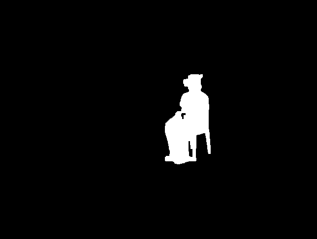
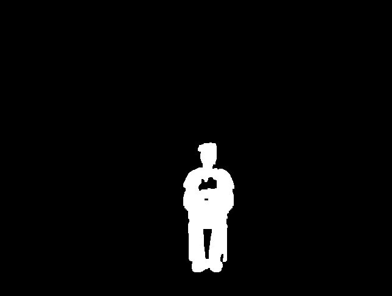
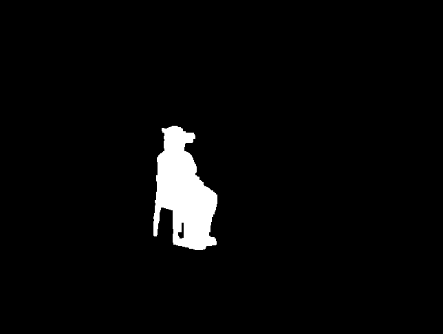

<h1 align="center">Assignment 3 of Computer Vision👋</h1>
<p>
  
  <a href="123" target="_blank">
    
  </a>
  <a href="https://github.com/Monsterlady-Studio/lastwordExchange/blob/master/LICENSE" target="https://raw.githubusercontent.com/Monsterlady-Studio/lastwordExchange/master/LICENSE?token=AJGKZIFFEUQVTR2MGIHOZ5S7G3DIY">
    
  </a>
</p>

[//]: # (> 方便快捷的储存游戏账号和密码)

[//]: # (### 🏠 [主页]&#40;123&#41;)

[//]: # ()
[//]: # (### ✨ [Demo]&#40;123&#41;)

# Preparation

## IDE


[PyCharm](https://www.jetbrains.com/pycharm/) <br />


## Environment
```python
Python Version: 3.9.18
```


## Install
```python
pip install -r requirements.txt
```

## Usage
```python
python main.py
```


[//]: # ([Android Studio]&#40;https://redirector.gvt1.com/edgedl/android/studio/install/4.0.1.0/android-studio-ide-193.6626763-windows.exe&#41; <br />)

[//]: # (Xcode&#40;ios&#41;)

# Documentation
## Color Modeling
- **Camera 1**
    ```xml
    <?xml version='1.0' encoding='utf-8'?>
    <opencv_storage>
        <CameraMatrix type_id="opencv-matrix">
            <rows>3</rows>
            <cols>3</cols>
            <dt>f</dt>
            <data>
                494.98254306535125 0.0 325.39368447866417
                0.0 501.1204833023976 227.05681175884558
                0.0 0.0 1.0
            </data>
        </CameraMatrix>
        <DistortionCoeffs type_id="opencv-matrix">
            <rows>1</rows>
            <cols>1</cols>
            <dt>f</dt>
            <data>-0.36386751627418557 0.3734154803248677 0.0025728227962733444 0.0019012712596908198 -0.31410762219413624
            </data>
        </DistortionCoeffs>
        <RVecs type_id="opencv-matrix">
            <rows>3</rows>
            <cols>1</cols>
            <dt>f</dt>
            <data>-0.6603094349760988 -1.5977957264784002 -1.9007182824090147</data>
        </RVecs>
        <TVecs type_id="opencv-matrix">
            <rows>3</rows>
            <cols>1</cols>
            <dt>f</dt>
            <data>4.260299135099409 7.602771601199735 33.02949737230121</data>
        </TVecs>
  </opencv_storage>
  ```
- **Camera 2**
    ```xml
  <?xml version='1.0' encoding='utf-8'?>
  <opencv_storage>
      <CameraMatrix type_id="opencv-matrix">
          <rows>3</rows>
          <cols>3</cols>
          <dt>f</dt>
          <data>487.69048117198247 0.0 326.8012878926258 0.0 490.6060070883287 232.64336746283303 0.0 0.0 1.0</data>
      </CameraMatrix>
      <DistortionCoeffs type_id="opencv-matrix">
          <rows>1</rows>
          <cols>1</cols>
          <dt>f</dt>
          <data>-0.3639583476007651 0.22579014210690337 -0.0003453509118134192 0.0011071481872085946
              -0.11434125987351754
          </data>
      </DistortionCoeffs>
      <RVecs type_id="opencv-matrix">
          <rows>3</rows>
          <cols>1</cols>
          <dt>f</dt>
          <data>-0.044127003877045386 -2.207210193931621 -2.1954810993359</data>
      </RVecs>
      <TVecs type_id="opencv-matrix">
          <rows>3</rows>
          <cols>1</cols>
          <dt>f</dt>
          <data>4.7866242255120985 12.51938734990695 26.6448060821804</data>
      </TVecs>
  </opencv_storage>
  ```
- **Camera 3**
    ```xml
  <?xml version='1.0' encoding='utf-8'?>
  <opencv_storage>
      <CameraMatrix type_id="opencv-matrix">
          <rows>3</rows>
          <cols>3</cols>
          <dt>f</dt>
          <data>492.8402142965422 0.0 318.1768733551463 0.0 493.39578289449634 237.04550616599929 0.0 0.0 1.0</data>
      </CameraMatrix>
      <DistortionCoeffs type_id="opencv-matrix">
          <rows>1</rows>
          <cols>1</cols>
          <dt>f</dt>
          <data>-0.3454572393392778 0.15517766255191656 0.0014488060184385595 -0.00019689849293684733
              -0.019148411243715847
          </data>
      </DistortionCoeffs>
      <RVecs type_id="opencv-matrix">
          <rows>3</rows>
          <cols>1</cols>
          <dt>f</dt>
          <data>-1.2510425941390755 1.0003221285900046 1.0585410202102281</data>
      </RVecs>
      <TVecs type_id="opencv-matrix">
          <rows>3</rows>
          <cols>1</cols>
          <dt>f</dt>
          <data>-2.887512679235995 10.14430679674377 29.856518535510666</data>
      </TVecs>
  </opencv_storage>
  ```
- **Camera 4**
    ```xml
    <?xml version='1.0' encoding='utf-8'?>
  <opencv_storage>
      <CameraMatrix type_id="opencv-matrix">
          <rows>3</rows>
          <cols>3</cols>
          <dt>f</dt>
          <data>495.56131779921225 0.0 336.7794571106693 0.0 498.45483142109174 245.47422925524208 0.0 0.0 1.0</data>
      </CameraMatrix>
      <DistortionCoeffs type_id="opencv-matrix">
          <rows>1</rows>
          <cols>1</cols>
          <dt>f</dt>
          <data>-0.33136347160908175 0.08572521687369193 -0.0008504068595025769 0.0007517694488594014
              0.08187253283556994
          </data>
      </DistortionCoeffs>
      <RVecs type_id="opencv-matrix">
          <rows>3</rows>
          <cols>1</cols>
          <dt>f</dt>
          <data>-0.736676197279276 1.5666462916922104 1.809863551236049</data>
      </RVecs>
      <TVecs type_id="opencv-matrix">
          <rows>3</rows>
          <cols>1</cols>
          <dt>f</dt>
          <data>0.4434229565343957 7.707516206544021 38.96796250409643</data>
      </TVecs>
  </opencv_storage>
  ```
[//]: # (We conducted three calibration runs to evaluate the impact of different image qualities and calibration settings. )
[//]: # (The resolution of our training and test images is 1280 * 720.)

[//]: # (<br/>)

[//]: # (We run the offline phase three times, each time saving the camera’s intrinsic/extrinsic parameter matrices.)

[//]: # (<br/>)

[//]: # (For those images that cannot be detected, we will require manual marking of 4 corner points.)

[//]: # (<br/>)

[//]: # (The left click marks and the right click deletes.)


## Voxel space
### Auto Thresholds
First, we manually separate the foreground and background using Photoshop, then set the foreground to white and the background to black. Next, we create a mask through a for loop to calculate the similarity between each mask and the manually separated foreground and background, thereby finding the optimal threshold. Furthermore, after this, we use morphological operations, such as erosion and dilation, on the image to remove some noise.

```python
# Method details in 
import Background_Subtraction.background_subtraction

Background_Subtraction.background_subtraction.find_optimal_thresholds
Background_Subtraction.background_subtraction.post_process_foreground
```
### Forehead Images
- **Camera 1**
    
- **Camera 2**
    
- **Camera 3**
    
- **Camera 4**
    


## Choice Tasks and Implementation
Here, briefly mention the choice tasks we've selected for the project and how we implemented them. 

- **Task 1:  Automating the way the thresholds are determined: 10.**
  - Make a manual segmentation of a frame into foreground and background (e.g., in Paint). Then implement a function that finds the optimal thresholds by comparing the algorithm’s output to the manual segmentation. 
  - Detail Method: ``` Background_Subtraction.background_subtraction.find_optimal_thresholds```
- **Task 2:  Coloring the voxel model: 15.**
  - Create a list to store the voxel positions and colors. Then, for each voxel, calculate the color based on the average color of the pixels in the corresponding region of the input images.
  - Detail Method: ``` assignment.set_voxel_positions```
- **Task 3: Speeding-up the background subtraction: 5.**
  - Parallelize the similarity calculation in the background subtraction algorithm.
  - Detail Method: ``` Background_Subtraction.background_subtraction.calculate_similarity_parallel```

## Voxel Reconstruction
Youtube Video: [Youtube](https://youtu.be/R5zVWo1DbWg)

## Students(Group 18)

👤 **Ruikang Xu - 2881349**

👤 **Yuheng Cao - 9441700**

## 🤝 Contribution

All team members worked together in several meetings. All team members equally devoted to the
parts of the assignment.


