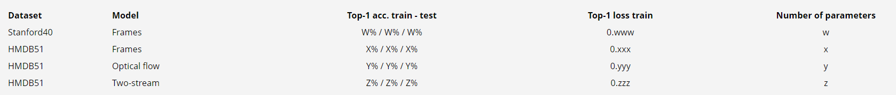

# Overall goal and software
1. You will be making use of your Assignment 2 code, including your background subtraction. If your submission is not usable, a solution will be provided two days after the deadline of Assignment 2.
2. Instead of looking at a small part of the space, we will now look at a larger area so make sure your voxel space is large enough.
3. You can download four, 4-person, videos. You should be able to reconstruct its 3D data without a problem if you correctly did Assignment 2.
4. The goal of this assignment is to (1) make a color model for each person offline and (2) label the voxels based on this color model in subsequent frames.

# OFFLINE: make color model for each person
1. You will use videos with 4 persons walking around, download  here . To create the color models, we use a single camera (choose one). Combining the results of multiple cameras will improve the robustness of your approach, and is a choice task.
2. For the best results, make sure that you find a frame in which the persons are largely visible (not occluded), and that the people are as well separated as possible. You can select a different (time) frame for each camera if you use more cameras.
3. Calibrate the extrinsics for all views because they differ from the positions and orientations in Assignment 2. There is again one video per camera that you can use. You can assume that the intrinsics are the same.
4. Cluster the positions of the voxels (ignore the height) using K-means from OpenCV. Use K-means in such a way that you don’t get stuck in a local minimum (check the function flags). This should give you (1) a label for each voxel and (2) a number of cluster centers, each corresponding to the center of the person. Make sure your voxel grid covers the walking space sufficiently
5. Per person, project all voxels to the camera image of your selected camera (or multiple cameras). Make color models based on the projected frame pixels, for each person. You can do anything you like, including color histograms (1, 2 or 3 channels, in different color spaces, find a suitable one) and Gaussian Mixture Models (using Expectation Maximization (EM) in OpenCV). A mean color will not grant you the full points for this step. Looking at your data helps to determine which option is wise. Think carefully whether all voxels should be used. For example, the trousers of the people don't really have a distinct color. Can you ignore part of the voxels based on height? If you use multiple cameras (choice task), consider building a color model per view. You will have to implement the color model yourself. No code from a third party.

# ONLINE: track the people
When you have the color model of all persons, you can figure out in each new frame which cluster of voxels is which person. To this end, we do the clustering and color model calculation in the same way as in the offline steps. Then we compare the offline color models to the new ones. Specifically:
1. Given a frame, make the voxel model and cluster the voxels with K-Means, as in the offline setting. You are not allowed in your main results to initialize your clusters with the locations in the previous frame. Again, avoid local minima. You will end up with 4 clusters of voxels. The clusters should correspond to the four people. But, typically, cluster 1 does not correspond to person 1, etc., so we need to find out which cluster belongs to which person. This is a matching task. As a choice task, you can deal with the situation that one or more people are outside the voxel space. Detect this from the locations of the found clusters and adjust your matching.
2. Determine each cluster’s person label (color) by creating a color model from each cluster and compare it to the offline color models based on a distance measure suitable for your color model. For mean color and histograms, do not match per pixel but use all pixels in the cluster. For GMMs, you can use the predict function to calculate the distance of a pixel (color) to each of the offline trained GMMs. Project all voxels with the same cluster label to your one (or more when doing this choice task) selected view(s) and then determine from there which person they correspond to. Matching multiple people to the same cluster will not grant you the full points. You can have a look at the Hungarian algorithm, and are allowed to use external implementations of it.
3. Store the 2D position of the cluster (so of each person) on the floor. Make a graph with the 2D positions of each person over the entire duration of the video. You can do this using OpenCV functions or in any other software package, based on stored cluster centers. See image below.

Example image of trajectories over the entire video length

# Report
Hand in a report (2 pages). You can use  this template this template - Alternative Formats , but feel free to deviate from the suggested lengths. Your report should contain:
1. A brief description of your implementation (how was the voxel space set, how did you create the color models, how did you do the matching) and motivation of your choices.
2. A link to a video with voxels colored according to the clustering (see example below). The video should contain at least 100 processed frames, covering several seconds, shown from multiple angles.
3. An image with the colored 2D trajectories of each person for the duration of the video.
4. Clearly mention which choice tasks you implemented. Briefly explain how you addressed them.

# Submission
Through Blackboard, hand in the following two deliverables:
1. A zip of your code (no binaries, no libraries, no data files)
2. A report

# Grading
The maximum number of points for this assignment is 100. The assignment counts for 10% of the total grade. You can get up to 80 points for these tasks:

- Voxel models correctly calculated: 10
- Clustering correct: 10
- Offline construction of color models: 15
- Quality of identification (matching): 15
- Video (clear what the output of your algorithm is): 10
- Path image (without choice task "tracking" applied): 10
- Report (clearly motivate decisions, indicate choice tasks): 10

In addition, you can earn a maximum of 20 choice points:
- CHOICE 1: Use multiple cameras to increase the robustness: 15. You need to combine the information in the matching step.
- CHOICE 2: Find a way to deal with situations in which people are missing or merged: 10. Reason about when to decrease the number of clusters.
- CHOICE 3: Implement tracking based on previous position and/or movement: 5 Only eligible if you show the results with and without tracking in your trajectory image and video.
- CHOICE 4: Smooth trajectories: 5 Can be a post-processing step, show the results in your trajectory image.
- CHOICE 5: Get rid of outliers and ghost voxels: 10 Based on the clustering, find out which voxels should be removed altogether so they don’t influence the calculation of the center.
- CHOICE 6: Update your color model over time: 10 Based on confident identifications, gradually update your color model.
- CHOICE 7: Dealing with occlusion in creating the color models: 20. Only take into account voxels that are actually visible from a view.

# Example result from previous years
https://www.youtube.com/watch?v=uWKwsgbbU7I

